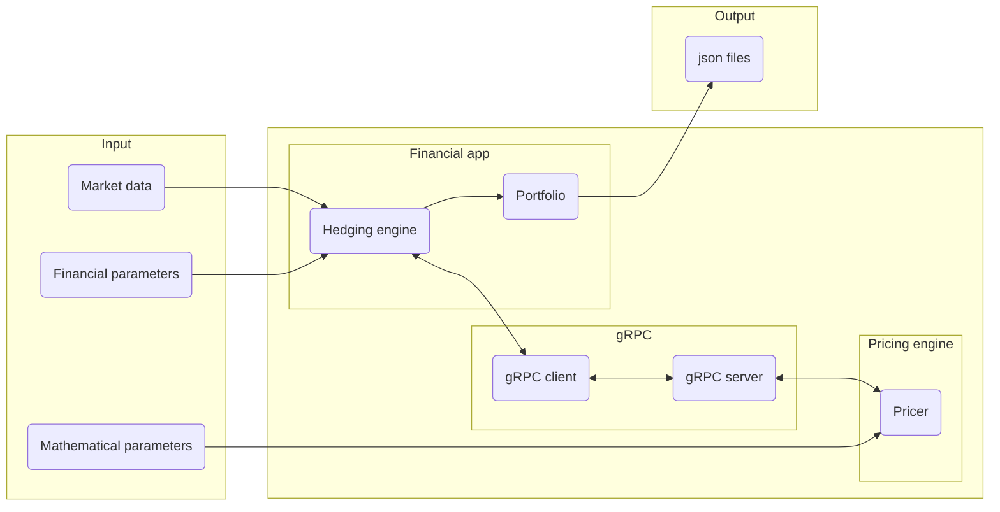

# Multi-Stream Hedging Project

## Overview
The Multi-Stream Hedging project is designed to handle the hedging of exotic options, specifically **Conditional Basket** and **Conditional Max** options. The application enables users to request delta-neutral backtesting, where the portfolio is rebalanced periodically to maintain delta neutrality. The system involves two main components:

1. **Financial Application**: Manages the hedging process through the HedgeEngine, rebalancing the portfolio and requesting option prices from the Mathematical Application.
2. **Mathematical Application**: Contains the PriceEngine, which calculates option prices and provides them to the Financial Application through a gRPC server.

The communication between these two applications is achieved using the **gRPC protocol**. The Mathematical Application runs a gRPC server that listens on a specified port, while the Financial Application acts as a gRPC client, requesting pricing data at each rebalancing step. The final output includes the hedging results, including prices and deltas, from the start to the option's maturity date.

The following graph illustrates it :



---

We consider $`M\in \mathbb{N}`$ payment dates $`(t_1,\ldots, t_M)`$. At each date $`t_m`$ for $`m \in \{1,\dots, M\}`$, the product pays a flow that depends on the underlying values up to the current date $`m`$.

We consider two specific products:

### The Conditional Basket (`conditional_basket`)

Let $`(K_1,\ldots, K_M)`$ be $`M`$ strikes. We define:

```math
\begin{align*}
P_0 & = 0\\
P_m & = \left(\frac{1}{N} \sum_{n=1}^N S^n_{t_m} - K_m\right)_+ \, \mathbb{1}_{P_k = 0 \; \forall k < m}
\end{align*}
```

The derivative product pays the flow $`P_m`$ at date $`t_m`$ for $`m \in \{1,\dots, M\}`$.

### The Conditional Max Call (`conditional_max`)

Let $`(K_1,\ldots, K_M)`$ be $`M`$ strikes. We define:

```math
\begin{align*}
P_0 & = 0\\
P_m & = \left(\max_{n \in \{1,\dots,N\}} S^n_{t_m} - K_m\right)_+ \, \mathbb{1}_{P_{m-1} = 0}
\end{align*}
```
The derivative product streams $`P_m`$ on the date $`t_m`$ for $`m \in \{1,\dots, M\}`$.
---

## Directory Structure

### Output
- **`basket_5_3_1_portfolio.json`**: JSON file containing portfolio results for the "Basket" option scenario with specific parameters.
- **`basket_8_4_3_portfolio.json`**: JSON file containing portfolio results for another "Basket" option scenario.
- **`max_5_3_1_portfolio.json`**: JSON file containing portfolio results for the "Max" option scenario with specific parameters.
- **`max_8_4_3_portfolio.json`**: JSON file containing portfolio results for another "Max" option scenario.

### src
Contains the source code for the project, organized into subdirectories:

1. **FinancialApp**: Contains the implementation of the Financial Application, including the HedgeEngine and gRPC client logic.
2. **GrpcClient**: Implements the gRPC client that communicates with the Mathematical Application.
3. **Input**: Stores input JSON files with parameters for different option scenarios (e.g., basket, max).
4. **mathematicalApp**: Contains the Mathematical Application, including the gRPC server and the PriceEngine for pricing options.
5. **UserConsole**: Provides a console interface for users to interact with the Financial Application.

### Additional Files
- **`AUTHORS`**: Lists the contributors to the project.
- **`LICENSE`**: Contains the licensing information for the project.
- **`Output_Parser.py`**: Python script for parsing and visualizing the output JSON files (e.g., plotting prices and deltas for comparison).
- **`README.md`**: Documentation file explaining the project.

---

## How to Run
The following describes how you can run the app on windows architechture, supposed you have all of the following installed and the configuration set. 
- Visual Studio 2022.
- Cmake gui.
- git.
- pnl_library (fichier pnl-win-64): https://github.com/pnlnum/pnl/releases
- vcpkg (depuis ce git: https://github.com/microsoft/vcpkg#quick-start-windows)
- Run the following commands, to install requirements :
1- .\vcpkg.exe install protobuf:x64-windows
2- .\vcpkg.exe install grpc:x64-windows
3- .\vcpkg.exe install nlohmann-json:x64-windows
Dans Cmake-gui, ajouter les deux entrées suivantes:
1- CMAKE_PREFIX_PATH: chemin vers le dossier de libpnl qui contient les répertoires lib et include
2- CMAKE_TOOLCHAIN_FILE: chemin vers le fichier [racine vcpkg]/scripts/buildsystems/vcpkg.cmake

### Step 1: Start the gRPC Server
1. Navigate to the **mathematicalApp** directory.
2. Build and start the gRPC server using the provided instructions:
   ```bash
   cd build/Debug
   ./pricing_server <path-to-json-input-file>
   ```
   Example:
   ```bash
   ./pricing_server Input/Basket_5_3_1/basket_5_3_1_math_param.json
   ```

### Step 2: Run the Financial Application
1. Navigate to the **UserConsole** directory.
2. Launch the UserConsole to initiate the hedging process:
   ```bash
   dotnet run <path-to-market-data-file> <path-to-json-financial-params-input-file> <path-to-json-output-file>
   ```
   Example:
   ```bash
   dotnet run "Input/Basket_5_3_1/basket_5_3_1_mkt_data.csv" "Input/Basket_5_3_1/basket_5_3_1_params.json" "Input/Basket_5_3_1/basket_5_3_1_portfolio.json" 
   ```

### Step 3: View Results
The results of the hedging process, including prices and deltas, are stored in the **Output** directory. You can use the **Output_Parser.py** script to visualize the data, the python script takes 2 .json input files (the one you generate in /output and the one given in /input) as arguments and compares the prices on a graph.

---

## How to Test
- Use pre-defined input files in the **Input** directory and verify the output JSON files against expected results.
